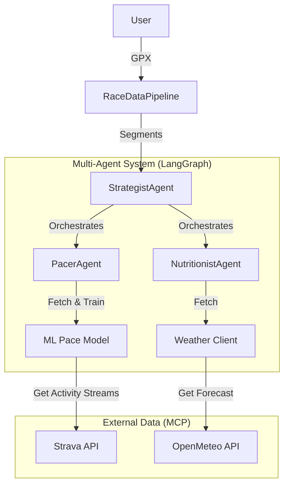

# Ultra-Trail Strategist V2 🏃‍♂️⛰️🤖

An Advanced Agentic AI application that generates professional-grade, segment-by-segment race strategies for ultra-distance runners. It uniquely combines geospatial course analysis with physiological athlete history to provide tactical advice.

## 🌟 Key Features (V2)

*   **Multi-Agent System**: A team of specialized AI agents working for you:
    *   **Pacer Agent**: Uses Machine Learning to predict split times based on your grade-adjusted pace history.
    *   **Nutritionist Agent**: Adapts fueling and hydration advice based on real-time **Weather Forecasts** (OpenMeteo) and segment duration.
    *   **Principal Strategist**: Synthesizes all advice into a cohesive race plan.
*   **Machine Learning Pacing**: Trains a `RandomForest` model on *your* Strava data to learn how you handle climbs vs flats.
*   **Smart Course Segmentation**: Automatically breaks down GPX files into: **Climbs** (>3%), **Descents** (<-3%), and **Flats**.
*   **MCP Server Integration**: Implements the **Model Context Protocol** to seamlessly connect AI agents to Strava and Weather APIs.

## 🏗️ Architecture



## 🚀 Getting Started

### Prerequisites

*   Python 3.10+
*   A Strava Account (with API Application created)
*   OpenAI API Key

### Installation

1.  **Clone and Install**:
    ```bash
    git clone https://github.com/yourusername/ultra-trail-strategist.git
    cd ultra-trail-strategist
    pip install .
    ```

2.  **Configuration**:
    Create a `.env` file in the root directory (copy `.env.example`):
    ```ini
    STRAVA_CLIENT_ID=your_id
    STRAVA_CLIENT_SECRET=your_secret
    STRAVA_REFRESH_TOKEN=your_refresh_token
    OPENAI_API_KEY=sk-...
    ```
    *Note: Ensure your Strava Refresh Token has `activity:read_all` scope.*

### Usage

Run the main application entry point:

```bash
python main.py
```

1.  It will prompt you for a **GPX file path**.
2.  (Optional) Press **Enter** to run in **Demo Mode** with synthetic data.
3.  The system will:
    *   Analyze the course topography.
    *   Train a pacing model on your recent runs.
    *   Check the weather forecast.
    *   Generate a comprehensive **Pacing, Nutrition, and Strategy Report**.

### Running Tests

To verify the installation and logic:

```bash
python -m unittest discover tests
```

## 📄 License

MIT
