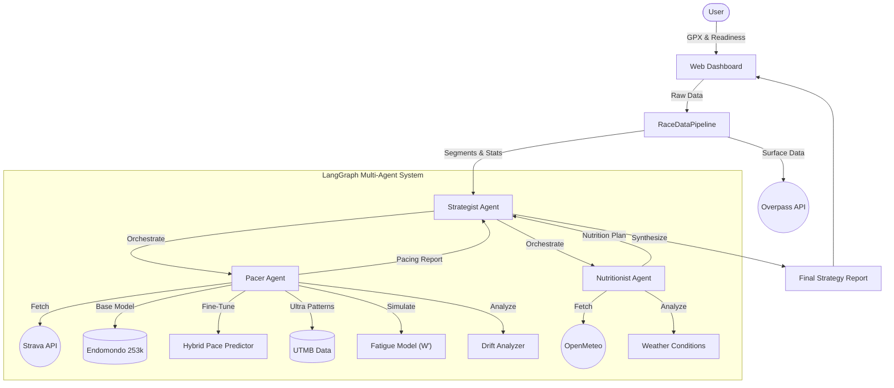
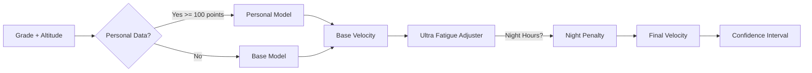

# 🏃‍♂️ Ultra-Trail Strategist (V4)

**AI-Powered Race Strategy for Ultra-Endurance Athletes**

## Overview
Ultra-Trail Strategist is an advanced AI application designed to help trail runners optimize their race day performance. It combines course typography analysis, historical athlete data, physiological modeling, and real-time weather forecasts to generate a comprehensive race strategy.

### 🌟 V4 Features (Hybrid Pace Prediction)
- **🧠 Hybrid Pace Predictor**: Three-tier prediction system:
  1. **Base Model**: Pre-trained on 253k Endomondo workouts for cold-start capability
  2. **Personal Fine-Tuning**: Adapts to your specific pace/grade curve from Strava history
  3. **Ultra Fatigue Adjustment**: Applies race-specific degradation patterns from UTMB data
- **📊 Confidence Intervals**: Uncertainty quantification for pace predictions (wider for extreme grades)
- **🌙 Night Penalty Modeling**: 12% pace reduction during night hours (22:00-06:00)
- **📈 Skill-Level Curves**: Different fatigue patterns for elite vs. recreational athletes
- **🔄 Backwards Compatible**: Existing `PacePredictor` API continues to work

### 🌟 V3 Features (Physiology & Personalization)
- **🔋 Fatigue Modeling (W' Balance)**: Simulates anaerobic work capacity depletion ("burning matches") and recovery during the race to prevent "bonking".
- **❤️ Cardiac Drift Analysis**: Analyzes historical long runs to detect aerobic decoupling and applies late-race endurance decay to pacing.
- **⛰️ Surface Analysis**: Uses OpenStreetMap data to detect terrain types (Road vs. Technical Trail) and applies surface-specific pacing drag.
- **⌚️ Athlete Readiness**: Adapts the strategy's aggressiveness based on a customizable Recovery Score (e.g., "Conservative" for low recovery).

### 🌟 V2 Features
- **Interactive Web Dashboard**: A user-friendly Streamlit interface for visualizing course data and strategies.
- **Machine Learning Pacing**: Using `scikit-learn`, the system learns your specific "Power/Grade" curve from Strava history to predict realistic splits.
- **Weather-Adaptive Nutrition**: Integrates real-time forecasts (via OpenMeteo) to adjust hydration and sodium recommendations.
- **Multi-Agent Orchestration**: Powered by **LangGraph**, a team of specialized agents (`Pacer`, `Nutritionist`) work together under a `Principal Strategist`.

## 📂 Project Structure
```
.
├── assets/                 # Demo data and images
│   ├── demo.gpx            # Sample course file
│   └── logo_UTS.png        # Project logo
├── data/                   
│   └── endomondo/          # FitRec dataset cache
├── models/                 
│   ├── endomondo_base.pkl  # Pre-trained base model
│   └── endomondo_base_metadata.json
├── src/
│   └── ultra_trail_strategist/
│       ├── agent/              # AI Agents (Strategist, Pacer, Nutritionist)
│       ├── data_ingestion/     
│       │   ├── endomondo_loader.py   # FitRec dataset (253k workouts)
│       │   ├── utmb_scraper.py       # Ultra race results scraper
│       │   ├── strava_client.py      # Personal activity data
│       │   ├── gpx_processor.py      # Course file parsing
│       │   └── weather_client.py     # OpenMeteo integration
│       ├── feature_engineering/ 
│       │   ├── pace_model.py         # HybridPacePredictor
│       │   ├── base_model_trainer.py # Gradient boosted model trainer
│       │   ├── ultra_fatigue_adjuster.py # Race-specific fatigue curves
│       │   ├── fatigue_model.py      # W' balance simulation
│       │   ├── drift_analyzer.py     # Cardiac drift detection
│       │   └── segmenter.py          # Course segmentation
│       └── pipeline.py         # Main data processing pipeline
├── tests/                  # Unit and integration tests
├── dashboard.py            # Streamlit Web Application
├── main.py                 # CLI Entry Point
└── pyproject.toml          # Dependencies
```

## 🚀 Getting Started

### 1. Prerequisites
- Python 3.10+
- An OpenAI API Key
- A Strava Account (Client ID/Secret)

### 2. Installation
```bash
# Clone and install dependencies
pip install -e .
```

### 3. Configuration
Create a `.env` file in the root directory:
```env
OPENAI_API_KEY="sk-..."
STRAVA_CLIENT_ID="12345"
STRAVA_CLIENT_SECRET="your_secret"
STRAVA_REFRESH_TOKEN="your_token"
```

### 4. Running the Application

#### 🖥️ Web Dashboard (Recommended)
Launch the interactive dashboard to upload GPX files and visualize your strategy.
```bash
streamlit run dashboard.py
```
*Note: You can use `assets/demo.gpx` to test the system.*

#### ⌨️ CLI Mode
Run the strategy generation from the command line:
```bash
python main.py path/to/course.gpx
```

### 5. Training the Base Model (Optional)
The pre-trained base model is included. To re-train from scratch:
```bash
pdm run python -c "
from ultra_trail_strategist.data_ingestion.endomondo_loader import EndomondoLoader
from ultra_trail_strategist.feature_engineering.base_model_trainer import BaseModelTrainer

loader = EndomondoLoader()
loader.download_dataset('raw')  # Downloads ~1.5GB

df = loader.to_training_data(sport_filter=['run'], max_workouts=5000)
trainer = BaseModelTrainer()
result = trainer.train(df)
trainer.save_model(result)
"
```

## 🧪 Testing
Run the comprehensive test suite to verify all components:
```bash
make check  # Runs lint, type-check, and tests
# or individually:
pdm run pytest tests/ -v
```

## 🏗️ Architecture

The system uses a **Retrieval-Augmented Generation (RAG)** approach extended with **Agentic Workflows**, **Hybrid ML Prediction**, and **Physiological Simulation**:



### Hybrid Pace Prediction Flow



1.  **Ingest**: Parse GPX course data, fetch Strava history, and check OSM Surface types.
2.  **Enrich**: Calculate grade-adjusted pace using hybrid model, fetch weather forecast, and assess athlete readiness.
3.  **Plan**: `PacerAgent` and `NutritionistAgent` generate domain-specific plans using ML and Physiological models.
4.  **Synthesize**: `StrategistAgent` compiles everything into a final Markdown report.

## 📊 Model Performance

**Base Model (Gradient Boosting on Endomondo/FitRec dataset)**:
- Training data: 929,568 samples from 5,000 running workouts
- Features: Grade (53% importance), Altitude (47% importance)
- MAE: 0.53 m/s (~1.9 km/h)
- R² Score: 0.168

*Note: R² is modest because pace depends on many unmeasured factors (fitness, fatigue, conditions). The model provides a reasonable baseline that improves significantly with personal fine-tuning.*

---
*Built with LangChain, LangGraph, Polars, Scikit-Learn, and Streamlit.*
