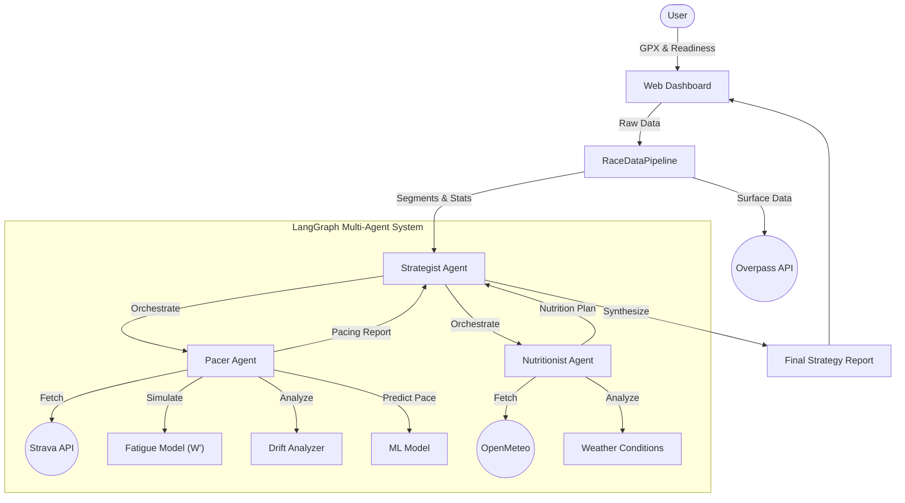

# 🏃‍♂️ Ultra-Trail Strategist (V3)

**AI-Powered Race Strategy for Ultra-Endurance Athletes**

## Overview
Ultra-Trail Strategist is an advanced AI application designed to help trail runners optimize their race day performance. It combines course typography analysis, historical athlete data, physiological modeling, and real-time weather forecasts to generate a comprehensive race strategy.

### 🌟 V3 Features (Physiology & Personalization)
- **🔋 Fatigue Modeling (W' Balance)**: Simulates anaerobic work capacity depletion ("burning matches") and recovery during the race to prevent "bonking".
- **❤️ Cardiac Drift Analysis**: Analyzes historical long runs to detect aerobic decoupling and applies late-race endurance decay to pacing.
- **⛰️ Surface Analysis**: Uses OpenStreetMap data to detect terrain types (Road vs. Technical Trail) and applies surface-specific pacing drag.
- **⌚️ Athlete Readiness**: Adapts the strategy's aggressiveness based on a customizable Recovery Score (e.g., "Conservative" for low recovery).

### 🌟 V2 Features
- **Interactive Web Dashboard**: A user-friendly Streamlit interface for visualizing course data and strategies.
- **Machine Learning Pacing**: Using `scikit-learn`, the system learns your specific specific "Power/Grade" curve from Strava history to predict realistic splits.
- **Weather-Adaptive Nutrition**: Integrates real-time forecasts (via OpenMeteo) to adjust hydration and sodium recommendations.
- **Multi-Agent Orchestration**: Powered by **LangGraph**, a team of specialized agents (`Pacer`, `Nutritionist`) work together under a `Principal Strategist`.

## 📂 Project Structure
```
.
├── assets/                 # Demo data and images
│   ├── demo.gpx            # Sample course file
│   └── logo_UTS.png        # Project logo
├── src/
│   └── ultra_trail_strategist/
│       ├── agent/          # AI Agents (Strategist, Pacer, Nutritionist)
│       ├── data_ingestion/ # Strava, GPX, Weather, Surface clients
│       ├── feature_engineering/ # ML Pace Model, Segmentation, Fatigue, Drift
│       └── pipeline.py     # Main data processing pipeline
├── tests/                  # Unit and integration tests
├── dashboard.py            # Streamlit Web Application
├── main.py                 # CLI Entry Point
└── pyproject.toml          # Dependencies
```

## 🚀 Getting Started

### 1. Prerequisites
- Python 3.10+
- An OpenAI API Key
- A Strava Account (Client ID/Secret)

### 2. Installation
```bash
# Clone and install dependencies
pip install -e .
```

### 3. Configuration
Create a `.env` file in the root directory:
```env
OPENAI_API_KEY="sk-..."
STRAVA_CLIENT_ID="12345"
STRAVA_CLIENT_SECRET="your_secret"
STRAVA_REFRESH_TOKEN="your_token"
```

### 4. Running the Application

#### 🖥️ Web Dashboard (Recommended)
Launch the interactive dashboard to upload GPX files and visualize your strategy.
```bash
streamlit run dashboard.py
```
*Note: You can use `assets/demo.gpx` to test the system.*

#### ⌨️ CLI Mode
Run the strategy generation from the command line:
```bash
python main.py path/to/course.gpx
```

## 🧪 Testing
Run the comprehensive test suite to verify all components:
```bash
python -m unittest discover tests
```

## 🏗️ Architecture

The system uses a **Retrieval-Augmented Generation (RAG)** approach extended with **Agentic Workflows** and **Physiological Simulation**:



1.  **Ingest**: Parse GPX course data, fetch Strava history, and check OSM Surface types.
2.  **Enrich**: Calculate grade-adjusted pace, fetch weather forecast, and assess athlete readiness.
3.  **Plan**: `PacerAgent` and `NutritionistAgent` generate domain-specific plans using ML and Physiological models.
4.  **Synthesize**: `StrategistAgent` compiles everything into a final Markdown report.

---
*Built with LangChain, LangGraph, Polars, Scikit-Learn, and Streamlit.*
